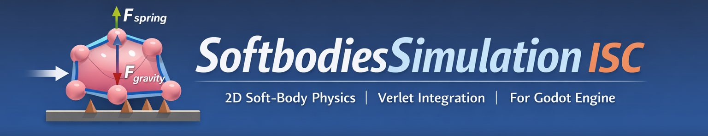
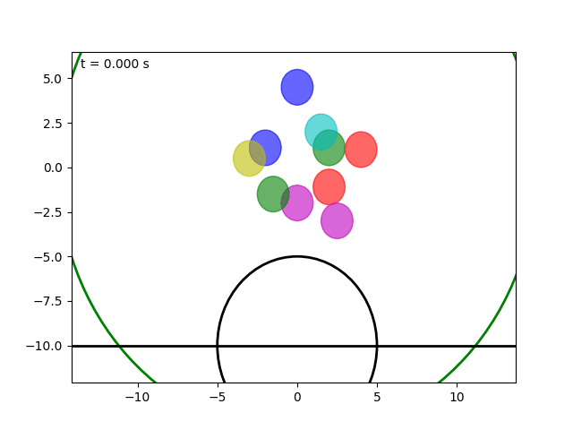
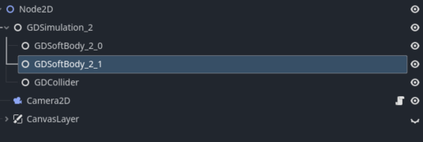
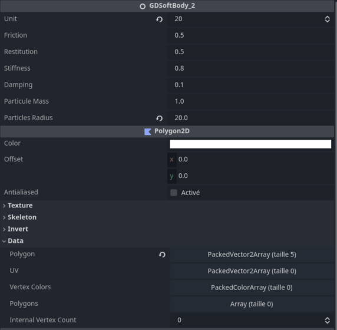

<p align="center">
  
</p>

<p align="center">
  <b>2D Soft-Body Physics Simulation Library (C++ / Godot)</b>
</p>

[](https://github.com/mariethoz/SoftbodiesSimulation_ISC/actions/workflows/build.yml)

<p align="center">
  <a href="docs/DEVELOPER_GUIDE.md">Developer Guide</a> •
  <a href="docs/output/html/index.html">API Docs (off line)</a>
</p>


This project aims to develop a 2D soft-body physics simulation library based on particle systems, Verlet integration, and constraints, and using **GDExtension** to create a **Godot** plugin.


This project is part of the semester project (303.1) for the Bachelor's degree in **Computer Science and Communication Systems** (*Informatique et Systèmes de Communication* ISC).


## Table of contens

- [About](#about)
    - [Architecture Overview](#architecture-overview)
- [How to Build](#how-to-build)
    - [C++ (Standalone)](#c-standalone)
    - [Python Visualization](#python-visualisation)
    - [Godot Plugin](#godot-plugin)
- [Use in Godot](#use-in-godot)
- [Resources & Documentation](#resources--documentation)
- [Contributing](#contributing)


## About

This project provides a **soft-body physics engine** designed for educational and experimental purposes.

The simulation is based on:
- Particle-based modeling
- Verlet integration for numerical stability
- Distance constraints for shape preservation
- World and body-body collision handling
- Configurable friction and restitution



The engine can be used:
- As a **standalone C++ simulation**
- With **Python visualization**
- As a **Godot 2D plugin** via GDExtension

## How to build

__Note__: Since this project uses Git submodules, downloading it as a `.zip` will omit some components. It is recommended to clone the repository instead.

```bash
git clone --recursive <repository-url>
```

### C++ (Standalone)
#### Build instruction

From the root of your project (where the `CMakeLists.txt` file is located):

```bash
cmake -S . -B build
cmake --build build
```

Depending on the compiler and platform, locate the generated executable and run it (example for Windows + MSVC):

```bash
.\build\Debug\*.exe
```

#### Python visualisation

After running the C++ program, a **CSV file** containing simulation data will be generated.

First create a Python virtual environment:

```bash
uv venv -r requirements.txt
```

The you can run the animation and plot scripts;

```bash
uv run python ./visuals/*.py
```

### Godot plugin

__Note__: Only the windows version was tested.

#### Build api

From the root of the project, run:
```bash
scons platform=windows demo_only=0
```

If you like to build only the demo version:
```bash
scons platform=windows demo_only=1
```

This will generate the required libraries in the `lib/` directory. You can then copy these files into your Godot project.

Example structure inside a Godot project:

```bash
res://
├── extensions/
│   └── softbody.gdextension
├── bin/
│   └── *   # Generated libraries
├── ...

```
The provided `.gdextension` file is only an example and can be freely modified to fit your project.

### Use in Godot

The current version uses three main nodes:
- `GDSimulation_2`
- `GDSoftBody_2`
- `GDCollider`

Example scene hierarchy:

```bash
Node2D
├── ...
├── GDSimulation_2
│   ├── body_1 : GDSoftBody_2
│   ├── body_2 : GDSoftBody_2
│   ├── body_3 : GDSoftBody_2
│   ├── world_1 : GDCollider
│   └── world_2 : GDCollider
├── ...
```


You can configure gravity and debug visualization directly from the `GDSimulation` editor interface.

`GDSoftBody_2` inherits from `Polygon2D`, allowing it to render shapes directly in Godot. Avoid polygons with sharp angles, as they may introduce unstable or unpredictable behavior in the simulation.



`GDCollider` have 3 options depending of the desired world interaction.


## Resources & Documentation

### Sources & References

- [Computer Science and Communication Systems (ISC Bachelor Program)](https://www.hevs.ch/en/schools/school-of-engineering/computer-science-and-communication/bachelor-s-degree-programme-in-computer-science-and-communication-systems-201140)
- [Verlet Integration Example (GitHub)](https://github.com/johnBuffer/VerletSFML) - VerletSFML by johnBuffer
- [Verlet Integration Tutorial (YouTube)](https://www.youtube.com/watch?v=kyQP4t_wOGI) - Soft Body Physics Explained by Gonkee
- [Godot GDExtension C++ Example](https://docs.godotengine.org/en/4.4/tutorials/scripting/gdextension/gdextension_cpp_example.html) - Official Godot Documentation

### Acknowledgements

- [Doxygen](https://www.doxygen.nl/) – Documentation generation tool  
- [nlohmann/json](https://github.com/nlohmann/json/tree/v3.12.0?tab=readme-ov-file) – JSON library for C++  
- GPT & Copilot – AI assistance for code review, comments generation, and explanation


## Contributing

Contributions are welcome!

If you want to understand the internal architecture, extend the physics engine,
or add new features, please read the developer documentation:

**[Developer Guide](docs/DEVELOPER_GUIDE.md)**

The guide covers:
- Simulation architecture
- Code structure
- Memory ownership rules
- Documentation conventions
- How to write and run unit tests


